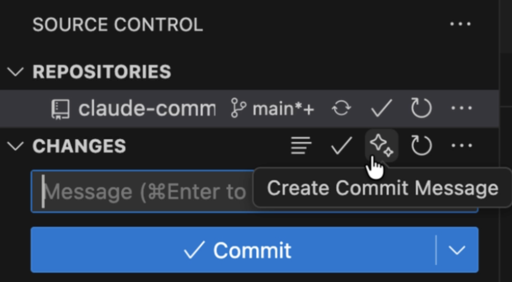

# Claude Commit

**Already using Claude Code? Get the commit message button you deserve – at no extra cost.**

A VS Code extension that brings the ✨ sparkle button to your Git panel, powered by the Claude CLI you already have. Generate intelligent commit messages without paying for additional AI services.



## Why Claude Commit?

You're already investing in Claude Code – whether it's Pro, Max ×5, or Max ×10. Why pay for Copilot or Cursor just for commit message generation? This extension leverages your existing Claude subscription to bring the same AI-powered commit message functionality directly to VS Code.

**Zero additional cost. Zero complexity. Just works.**

## Features

- **One-click commit message generation**: The sparkle button ✨ you know and love, right in VS Code's Source Control panel
- **Powered by your Claude CLI**: Uses your existing Claude installation – no extra API keys or subscriptions needed
- **Context-aware analysis**: Understands your git diff to generate meaningful commit messages
- **Flexible commit styles**: Choose from conventional commits, prefix-only, simple descriptions, or create your own custom template
- **Custom prompt templates**: Full control over AI prompts with `{diff}` and `{stats}` template variables
- **Edit with feedback**: Not satisfied? Click "Edit with feedback" to refine the message with AI assistance
- **Multi-line commit support**: Generate detailed commits with body and footer for complex changes
- **Model selection**: Choose between Haiku (fast), Sonnet (balanced), or Opus (most capable)
- **Multilingual support**: Works in English, Ukrainian, and Chinese
- **Flexible backend**: Automatically uses Claude CLI, with API fallback option
- **Smart runtime detection**: Finds Claude CLI from your PATH at runtime without modifying settings (perfect for WSL)
- **Custom BASE_URI support**: Works with custom Claude API endpoints via environment variables
- **In-memory caching**: Remembers the detected CLI path during your session for performance
- **Multi-repository support**: Intelligently detects and works with multiple Git repositories in workspace
- **Comprehensive logging**: Detailed debug logs in Output panel for troubleshooting
- **Privacy mode**: Optional restricted file permissions for temporary prompt files (Linux/macOS)
- **Auto-close notifications**: Configurable auto-dismiss for success messages
- **Progress indicators**: See exactly what's happening during generation
- **Seamless VS Code integration**: Works directly with the built-in Git interface

## Requirements

- VS Code 1.75.0 or higher
- Claude CLI installed and authenticated (comes with your Claude Code subscription)
- Git repository initialized in your workspace
- Internet connection for AI generation

### WSL Compatibility

This extension works seamlessly in Windows Subsystem for Linux (WSL) environments. The extension automatically detects the Claude CLI from the system's PATH at runtime without modifying your settings, ensuring compatibility across both Windows and WSL environments:

- **On Windows**: The extension finds `claude.exe` from the Windows PATH
- **In WSL**: The extension finds `claude` from the Linux PATH
- **No conflicts**: Leaving `claudeCommit.cliPath` empty allows automatic detection in both environments
- **Environment variables**: Login shell support ensures environment variables from `.bashrc`, `.profile`, etc. are properly loaded

### Custom API Endpoint Support

The extension supports custom Claude API endpoints through environment variables:

- **Custom BASE_URI**: Set environment variables for custom API endpoints (e.g., for enterprise deployments)
- **Login shell**: CLI commands are executed with login shell (`-l` flag) to properly load environment variables
- **Full compatibility**: Works with standard Claude API and custom endpoints without configuration changes

## Installation

1. Install the extension from the VS Code Marketplace
2. Ensure Claude CLI is installed (comes with your Claude Code subscription)
3. Open a project with a Git repository
4. Look for the sparkle ✨ button in your Source Control panel
5. On first use, if CLI is not auto-detected, you'll be prompted to configure the path

**That's it!** The extension will automatically find Claude CLI or guide you through one-time setup.

## How to Use

1. Make your code changes
2. Stage your changes (optional – works with unstaged changes too)
3. Click the sparkle ✨ button in the Source Control panel
4. Review the AI-generated commit message
5. Commit

**No configuration, no setup wizards, no complexity.**

## Extension Settings

This extension keeps it simple with optional settings:

* `claudeCommit.cliPath`: Path to Claude CLI executable (leave empty for auto-detection)
* `claudeCommit.apiKey`: Your Anthropic API key (only needed if using API method)
* `claudeCommit.preferredMethod`: Choose AI backend (`auto`, `cli`, or `api`) – defaults to `auto`
* `claudeCommit.model`: Claude model to use (`haiku`, `sonnet`, `opus`) – defaults to `haiku`
* `claudeCommit.language`: Commit message language (`en` for English, `ua` for Ukrainian, `zh` for Chinese) – defaults to `en`
* `claudeCommit.multiLineCommit`: Generate detailed multi-line commits with body and footer – defaults to `false`
* `claudeCommit.diffSource`: Which changes to use (`staged`, `all`, or `auto`) – defaults to `auto`
* `claudeCommit.claudeCodeManaged`: Let Claude Code generate commit messages with minimal intervention (only works with CLI method) – defaults to `false`
* `claudeCommit.keepCoAuthoredBy`: Keep Co-Authored-By signature in commit message (only works in Claude Code managed mode) – defaults to `false`
* `claudeCommit.messageAutoCloseSeconds`: Auto-close timeout for success message in seconds (0 to disable) – defaults to `5`
* `claudeCommit.privacyMode`: Restrict temporary prompt file permissions to owner-only on Linux/macOS – defaults to `false`
* `claudeCommit.commitStyle`: Commit message style format (`conventional`, `prefix`, `default`, or `custom`) – defaults to `conventional`
* `claudeCommit.customPromptTemplate`: Custom prompt template with `{diff}` and `{stats}` variables (only used when commitStyle is `custom`) – defaults to empty

## Configuration Examples

### Auto-detection (recommended)
```json
{
    "claudeCommit.preferredMethod": "auto"
}
```
The extension will automatically search for Claude CLI in common locations.

### Manual CLI path (for NVM users or custom installations)
```json
{
    "claudeCommit.cliPath": "/Users/you/.nvm/versions/node/v22.13.0/bin/claude",
    "claudeCommit.preferredMethod": "cli"
}
```

### Using Anthropic API as fallback
```json
{
    "claudeCommit.preferredMethod": "auto",
    "claudeCommit.apiKey": "your-api-key-here"
}
```

### Ukrainian interface
```json
{
    "claudeCommit.language": "ua"
}
```

### Chinese interface
```json
{
    "claudeCommit.language": "zh"
}
```

### Detailed multi-line commits
```json
{
    "claudeCommit.multiLineCommit": true
}
```
This generates commits with subject, body, and footer following the full conventional commits format.

### Using a specific model
```json
{
    "claudeCommit.model": "sonnet"
}
```
Available models: `haiku` (fast, default), `sonnet` (balanced), `opus` (most capable).

### Control diff source
```json
{
    "claudeCommit.diffSource": "staged"
}
```
Options: `auto` (default - uses staged if available, otherwise all), `staged` (only staged changes), `all` (all changes including unstaged).

### Claude Code managed mode
```json
{
    "claudeCommit.claudeCodeManaged": true,
    "claudeCommit.preferredMethod": "cli"
}
```
In this mode, Claude Code's haiku model generates commit messages with minimal intervention. Only a language hint is provided. Requires CLI method.

### Keep Co-Authored-By signature
```json
{
    "claudeCommit.claudeCodeManaged": true,
    "claudeCommit.keepCoAuthoredBy": true,
    "claudeCommit.preferredMethod": "cli"
}
```
Keeps the Co-Authored-By signature in commit messages. Only works in Claude Code managed mode.

### Customize auto-close timeout
```json
{
    "claudeCommit.messageAutoCloseSeconds": 10
}
```
Set to `0` to disable auto-close and keep the success message visible until manually dismissed.

### Privacy mode for temporary files
```json
{
    "claudeCommit.privacyMode": true
}
```
Restricts temporary prompt file permissions to owner-only (0600) on Linux/macOS. Windows ignores this setting.

### Commit message styles

#### Conventional Commits (default)
```json
{
    "claudeCommit.commitStyle": "conventional"
}
```
Generates: `feat(auth): added user login`

#### Prefix only (without scope)
```json
{
    "claudeCommit.commitStyle": "prefix"
}
```
Generates: `feat: added user login`

#### Simple description (no prefix)
```json
{
    "claudeCommit.commitStyle": "default"
}
```
Generates: `added user login`

#### Custom prompt template
```json
{
    "claudeCommit.commitStyle": "custom",
    "claudeCommit.customPromptTemplate": "Generate a concise commit message following our team's style.\n\nChanges:\n{stats}\n\nDiff (first 6000 chars):\n{diff}\n\nFormat: <category>: <description>\nCategories: feature, bugfix, refactor, docs, test, chore\nReturn only the commit message."
}
```
Use `{diff}` for git diff content (automatically limited to first 6000 characters) and `{stats}` for change statistics. This allows complete control over the prompt sent to Claude.

## Multi-Repository Support

The extension intelligently handles workspaces with multiple Git repositories:

- **Context-aware**: Automatically detects which repository you're working in based on:
  - The Source Control panel you clicked from (highest priority)
  - The currently active editor's containing repository
  - First repository as fallback
- **No configuration needed**: Works seamlessly with VS Code's built-in multi-repo support
- **Per-repository commits**: Generate commit messages for the correct repository every time

## Troubleshooting

### Claude CLI not found

The extension uses intelligent auto-detection to find Claude CLI **at runtime** without modifying your settings. If it's not found automatically:

1. **On first use**: The extension will prompt you to configure the path:
   - **Browse for CLI**: Opens a file picker to locate the executable
   - **Enter Path Manually**: Type the full path directly
   - **Skip (Use API)**: Fall back to API method (requires API key)

2. **Find your Claude CLI path manually**:
   ```bash
   which claude
   ```
   This shows the path (e.g., `/Users/you/.nvm/versions/node/v22.13.0/bin/claude`)

3. **Configure the path in settings** (only if needed):
   - Open VS Code Settings (Cmd+, or Ctrl+,)
   - Search for "claudeCommit.cliPath"
   - Paste the path from step 2
   - **Note**: Leave this empty for automatic runtime detection (recommended for WSL users)

4. **Auto-detection locations** (checked in order at runtime):
   - User-configured path in settings (if set)
   - In-memory cache (from previous detection in current session)
   - System PATH (via `which claude` or `where claude`)
   - Shell profile paths (~/.zshrc, ~/.bashrc on Unix-like systems)
   - Common installation paths:
     - `/usr/local/bin/claude`
     - `/opt/homebrew/bin/claude`
     - `~/.local/bin/claude`
     - `~/.nvm/versions/node/*/bin/claude` (NVM)
     - `~/.npm-global/bin/claude`

5. **Verify authentication**: Ensure Claude CLI is authenticated:
   ```bash
   claude --version
   ```

6. **Common issues**:
   - **WSL users**: Keep `claudeCommit.cliPath` empty to allow runtime detection in both Windows and WSL
   - **NVM users**: Auto-detection supports NVM paths via shell profile sourcing
   - **macOS**: The extension loads shell profiles to find paths
   - **Windows**: Checks common npm installation directories

### No commit message generated

1. Ensure you have changes in your repository (staged or unstaged)
2. Check that Claude CLI is properly authenticated
3. Try using API method as fallback:
   - Get API key from https://console.anthropic.com/
   - Add to settings: `claudeCommit.apiKey`
   - Set `claudeCommit.preferredMethod` to `api`

### Extension not working

1. Check you're in a Git repository
2. **Open Output panel** (View → Output) and select **"Claude Commit"** from the dropdown
3. Look for detailed log messages showing:
   - Where the extension is searching for Claude CLI
   - What command is being executed
   - What output (if any) is received from Claude
4. Try generating a commit message manually via Command Palette:
   - Press `Cmd+Shift+P` (or `Ctrl+Shift+P`)
   - Type "Claude Commit: Generate"
5. If CLI path is incorrect, clear `claudeCommit.cliPath` in settings to trigger re-detection

### "Empty response from CLI" error

This error means Claude CLI was found but didn't return any output. **Check the Output panel** (select "Claude Commit") for details:

1. **CLI Path**: Verify the detected path is correct
   - Look for "Found Claude CLI at: ..." in the logs
   - Test the path manually: run `<path> --version` in terminal

2. **Authentication**: Ensure Claude CLI is authenticated
   ```bash
   claude --version
   # Should show version without errors
   ```

3. **Command Execution**: Check the exact command being run
   - Look for "Executing: ..." in the logs
   - The command should pipe your changes to Claude CLI

4. **Common causes**:
   - **Not authenticated**: Run `claude` in terminal to authenticate
   - **Network issues**: Check your internet connection
   - **Permissions**: Try setting `claudeCommit.privacyMode: false`
   - **Corrupted install**: Reinstall Claude CLI (`npm install -g @anthropic-ai/claude-code`)
   - **Custom API endpoint**: Ensure environment variables for BASE_URI are properly set in your shell profile

### Using Custom API Endpoints

If you're using a custom Claude API endpoint (e.g., enterprise deployment):

1. **Set environment variables** in your shell profile (`.bashrc`, `.zshrc`, `.profile`):
   ```bash
   export BASE_URI="https://your-custom-endpoint.com"
   export ANTHROPIC_API_KEY="your-api-key"
   ```

2. **Reload your shell** or restart VS Code to apply changes:
   ```bash
   source ~/.bashrc  # or ~/.zshrc
   ```

3. **Verify the setup**:
   ```bash
   claude --version
   ```

The extension uses a login shell (`-l` flag) to ensure these environment variables are loaded when executing the Claude CLI.

## Privacy & Security

- Your code changes are processed through Claude CLI or Anthropic API
- No data is stored or transmitted by this extension beyond what Claude requires
- Authentication is handled by your existing Claude CLI setup or API key
- Code is only sent to Claude's servers through your authenticated session

## Examples

Generated commit messages follow conventional commits format:

```
feat(auth): added Google OAuth provider
fix(api): fixed validation error in user endpoint
refactor(store): optimized cart state management
docs(readme): updated installation instructions
```

## Contributing

Found a bug or have a feature request? Please open an issue on our [GitHub repository](https://github.com/uaoa/claude-commit-vscode).

## Author

Created by **Zakharii Melnyk**
- GitHub: [@uaoa](https://github.com/uaoa)
- LinkedIn: [undef-zakhar](https://www.linkedin.com/in/undef-zakhar)

## License

MIT License - see LICENSE file for details.

---

**Stop paying twice for AI commit messages. You've got Claude Code – now get the commit button. ✨**
